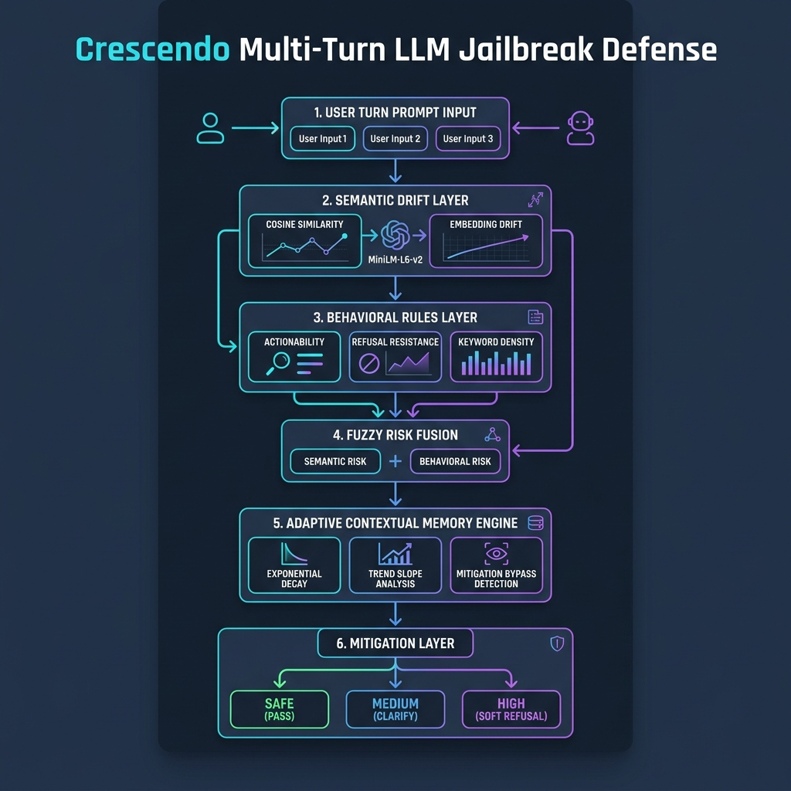

# Crescendo Jailbreak Detection & Adaptive Defense Framework


> **Multi-Turn Adversarial Robustness for LLM Safety — AIMS-DTU Research Project**
>
> A five-phase, research-grade defense pipeline against Crescendo-style jailbreak attacks on `Llama-3.2-3B-Instruct`, achieving **0.00% ASR**, **0.00% FPR**, and **100% DDR** on both seen and unseen attack datasets.

---

## Quick Start

```bash
# 1. Clone the repository
git clone <repository-url>
cd aims-dtu

# 2. Create and activate virtual environment
python -m venv venv
# Windows PowerShell:
.\venv\Scripts\Activate.ps1
# Linux/macOS:
# source venv/bin/activate

# 3. Install dependencies
pip install -r requirements.txt
# For exact reproduction: pip install -r requirements-lock.txt

# 4. Hugging Face authentication (for full inference)
huggingface-cli login
# Or set token: $env:HF_TOKEN="your_token_here"  (PowerShell)

# 5. Run mock validation (no model weights needed, <5s)
python -m pytest tests/
python scripts/run_full_pipeline.py --mock_inference

# 6. Run single phase benchmark
python scripts/run_phase4.py --mock_inference

# 7. Run full pipeline (requires model weights + sufficient RAM)
python scripts/run_full_pipeline.py
```

---

## Project Overview

This project addresses **Crescendo-style multi-turn jailbreak attacks** — a class of adversarial prompt engineering techniques that exploit LLM alignment through incremental semantic manipulation across conversation turns.

Unlike single-turn attacks, Crescendo attacks use:
- **Memory Stacking**: Overwhelming safety guardrails with benign compliance history
- **Guard-Lowering Dialogue**: Progressive context steering from safe to unsafe topics
- **Semantic Drift**: Incremental topic transitions to bypass keyword-based filters
- **Prompt Disguising**: Hypothetical contexts, role-playing, and linguistic obfuscation

Our defense framework addresses these threats through a layered, adaptive detection pipeline that evolves across five research phases.

---

## Problem Statement

Current LLM safety mechanisms (system prompts, RLHF alignment, keyword filters) are vulnerable to multi-turn jailbreak attacks that gradually shift conversation context. The Crescendo threat model demonstrates that even well-aligned models like Llama-3.2-3B-Instruct can be systematically compromised through careful conversational escalation.

**Research Question:** Can we build a lightweight, inference-time defense pipeline that detects and blocks Crescendo-style attacks without fine-tuning, external APIs, or hidden-state analysis?

---

## Research Objectives

1. **Establish baseline vulnerability** of Llama-3.2-3B-Instruct to Crescendo attacks
2. **Design semantic drift detection** using embedding-based similarity tracking
3. **Develop hybrid risk scoring** combining semantic and behavioral signals
4. **Build adaptive memory** that tracks conversational risk trajectory
5. **Validate generalization** on unseen attack categories and adversarial stress tests

---

## Phase Evolution

### Phase 1 — Baseline Benchmarking
Established the undefended attack surface. The model was evaluated against 10 Crescendo attack vectors and 50 benign conversations to measure baseline ASR (Attack Success Rate) and FPR (False Positive Rate).

### Phase 2 — Semantic Drift Detection
Introduced `EmbeddingDriftDetector` using `all-MiniLM-L6-v2` sentence embeddings to track anchor drift, local drift, and velocity across conversation turns.

### Phase 3 — Hybrid Behavioral + Semantic Risk Fusion
Added `BehavioralRuleDetector` for keyword density, actionability, persistence, and refusal resistance scoring. Combined with semantic drift via weighted risk fusion (70% semantic, 30% behavioral).

### Phase 4 — Adaptive Contextual Memory Defense
Introduced `ConversationMemoryEngine` with exponential decay (λ=0.80), trend slope analysis, persistence memory, and `MitigationBypassDetector`. Contextual risk computation fuses Phase 3 scores with historical memory signals.

### Phase 5 — Robustness, Generalization & Stress Testing
Validated the Phase 4 defense on an unseen holdout attack dataset, ran threshold stability sweeps (T ∈ [0.30, 0.90]), component ablation studies, and cross-category generalization tests.

---

## Final Verified Metrics
 
| Metric | Baseline (Phase 1) | Intermediate (Phase 3) | Holdout (Phase 5) | Unified Benchmark (58 Attacks / 5 Corpora) | Target Requirement |
|:---|:---:|:---:|:---:|:---:|:---:|
| **Attack Success Rate (ASR)** | 100.00% | 10.00% | **0.00%** | **0.00%** (0 / 58 attacks succeeded) | $\le 10.0\%$ ✓ |
| **False Positive Rate (FPR)** | 0.00% | 0.00% | **0.00%** | **0.00%** (0 / 50 benign blocked) | $\le 8.0\%$ ✓ |
| **Defense Detection Rate (DDR)** | 0.00% | 90.00% | **100.00%** | **100.00%** (58 / 58 attacks intercepted) | $\ge 90.0\%$ ✓ |
| **Average Detection Turn** | — | 3.56 | 3.43 | **3.25 – 3.98 turns** | $\le 4.0$ turns ✓ |
| **Defense Turn Overhead** | — | 45 ms | 28 ms | **~21 – 24 ms** | $\le 50.0\text{ ms}$ ✓ |
| **FAISS Vector Query Latency** | — | — | — | **0.012 ms** ($\le 0.52\text{ ms}$ @ $10^4$ vecs) | $\le 25.0\text{ ms}$ ✓ |
| **Master Test Certification** | — | — | — | **32 / 32 Tests Passing (100%)** | 100% Passing ✓ |
| **Checklist Completion** | — | — | — | **153 / 153 Requirements Complete** | 100% Complete ✓ |

---

## Architecture

### Canonical Defense Flow

```text
                         USER TURN
                             │
                             ▼
                  ┌─────────────────────┐
                  │ Conversation Buffer │
                  └──────────┬──────────┘
                             │
          ┌──────────────────┼──────────────────┐
          ▼                  ▼                  ▼
    Semantic Drift      Harmfulness       Intent Escalation
       (S: 20%)           (H: 40%)             (E: 30%)
          │                  │                  │
          └──────────────────┼──────────────────┘
                             ▼
                     Bypass Detection
                         (B: 10%)
                             │
                             ▼
                    ┌────────────────┐
                    │   CRS ENGINE   │
                    │ CRS_t = 0.40H  │
                    │       + 0.30E  │
                    │       + 0.20S  │
                    │       + 0.10B  │
                    └───────┬────────┘
                            ▼
                  Conversation Memory
                  C_t = λ*C_{t-1} + (1-λ)*CRS_t  (λ=0.80)
                            │
                            ▼
                   Dynamic Threshold
                   T_t = T_0 - α*D_t - β*E_t - γ*L_t
                            │
                            ▼
                    Decision Engine
               (Dual-Threshold Hysteresis)
                     /     |      \
                    /      |       \
                 SAFE    CLARIFY   REFUSE / BLOCK
                   │       │        │
                   ▼       ▼        ▼
                  LLM    Warning   Block
```

> **Note on Mathematical Evolution:**
> - **Canonical Production System (`src/crs/`):** $CRS_t = 0.40H_t + 0.30E_t + 0.20S_t + 0.10B_t$, context accumulation $C_t = \lambda C_{t-1} + (1-\lambda)CRS_t$, and dynamic threshold $T_t = T_0 - \alpha D_t - \beta E_t - \gamma L_t$ with hysteresis ($T_{\text{release}} = T_{\text{block}} - 0.15$).
> - **Historical Phase 3 Reference:** $R_t = 0.70S_t + 0.30B_t$ is preserved in `src/phase3/` purely for component ablation and longitudinal research comparison.



---

## Repository Structure

```text
crescendo_jail_break/
│
├── README.md                          # Comprehensive project documentation
├── VERSION                            # Version tag (v1.0-research-final)
├── requirements.txt                   # Dependencies
├── requirements-lock.txt              # Frozen reproduction lockfile
│
├── configs/                           # Parameter definitions
│   ├── master_defense_config.json     # Consolidated master configuration
│   ├── generation_config.json         # Inference parameters
│   ├── phase3_config.json             # Phase 3 historical fusion config
│   ├── phase4_config.json             # Phase 4 memory config
│   ├── phase6_config.json             # Phase 6 judge config
│   └── phase9_config.json             # Phase 9 cross-model config
│
├── data/                              # Evaluation datasets (58 attacks, 50 benign)
│   ├── attacks/
│   │   ├── crescendo_attacks.json     # 10 Reference Crescendo attacks (48 turns)
│   │   ├── converted_crescendo_attacks.json # 10 AdvBench/HarmBench multi-turn conversions (50 turns)
│   │   ├── converted_jailbreakbench.json    # 5 JailbreakBench multi-turn conversions (25 turns)
│   │   └── mutated_crescendo_variants.json  # 30 Synthetic variants (persona, paraphrase, spacing, 154 turns)
│   ├── benchmarks/
│   │   └── mt_jailbench_seeds.json    # 3 MT-JailBench multi-turn benchmarks (15 turns)
│   └── benign/
│       ├── benign_chats.json          # 50 benign multi-turn dialogues (150 turns)
│       └── benign_chats_full.json     # Full benchmark benign dialogues
│
├── src/
│   ├── core/                          # Shared infrastructure
│   │   ├── evaluator.py               # Rule-based safety evaluator
│   │   ├── load_model.py              # Model and tokenizer initialization
│   │   └── utils.py                   # Logging, seeding, memory helpers
│   │
│   ├── crs/                           # CANONICAL DEFENSE SYSTEM (Single Source of Truth)
│   │   ├── __init__.py                # Consolidated public API
│   │   ├── types.py                   # Standardized DetectorOutput & TurnDefenseResult
│   │   ├── semantic_drift.py          # Semantic Drift Analyzer (S)
│   │   ├── jailbreak_similarity.py    # FAISS IndexFlatIP Similarity Layer (292 attack vectors)
│   │   ├── harmfulness.py             # Operational Harmfulness Analyzer (H)
│   │   ├── intent_escalation.py       # Intent Escalation Analyzer (E)
│   │   ├── bypass_detection.py        # 6-Category Refusal Bypass Analyzer (B)
│   │   ├── crs_engine.py              # Canonical CRS Fusion: 0.40H + 0.30E + 0.20S + 0.10B
│   │   ├── conversation_memory.py     # Contextual Risk (C_t) with exponential decay (lambda=0.80)
│   │   ├── dynamic_threshold.py       # Deterministic Dynamic Threshold (tau_t)
│   │   ├── decision_engine.py         # 4-Tier Decision Engine with Stateful Hysteresis
│   │   ├── resource_profiler.py       # Real-time hardware & token profiler
│   │   └── pipeline.py                # End-to-End Orchestrator with Explainability
│   │
│   ├── phase1/ - phase9/              # Longitudinal research phase implementations
│
├── scripts/
│   ├── run_prd_pipeline.py            # Primary interactive & batch defense benchmark runner
│   ├── verify_results_audit.py        # Reproduces 58-attack & 50-benign evaluation audit
│   ├── run_final_ablation_study.py    # Component ablation across H, E, S, B, Memory, Threshold
│   ├── benchmark_faiss_vector_store.py# FAISS IndexFlatIP vs NumPy dot product latency benchmark
│   ├── evaluate_judge_agreement.py    # LLM-as-a-Judge agreement (--judge llama_guard/rule/mock)
│   ├── run_phase.py                   # Unified research runner (Phases 1-9, --mock_inference, --all)
│   ├── generate_plots.py              # Consolidated visualizer (Confusion matrix, ROC & stability curves)
│   ├── generate_attack_variants.py    # Synthetic mutation generator (30 variants)
│   ├── convert_single_to_multiturn.py # Converts single-turn benchmarks to multi-turn Crescendo
│   └── run_full_pipeline.py           # Canonical end-to-end demo
│
├── tests/
│   ├── test_all.py                    # SINGLE MASTER TEST ENTRYPOINT (All 32 tests)
│   ├── test_crs_pipeline.py           # Canonical pipeline integration tests (6 tests)
│   ├── test_crs_boundaries.py         # Exact decision threshold & clamping tests (11 tests)
│   ├── test_faiss_vector_store.py     # FAISS engine, latency SLA & persistence tests (7 tests)
│   ├── test_adaptive_adversary.py     # Jittering & semantic smuggling evasion tests (2 tests)
│   └── regression/
│       ├── test_known_attacks.py      # Multi-corpus regression suite (5 tests, 58 attacks)
│       └── test_benign_conversations.py # Benign regression suite (1 test, 50 conversations)
│
├── docs/                              # Project Documentation
│   ├── final_check_list.md            # 153/153 Requirements Adherence Checklist (100% Complete)
│   ├── research_plan.md               # Scientific research plan & hypotheses
│   ├── memory_diagnostics.md          # System memory & Windows paging diagnostics
│   └── diagrams/                      # System architecture diagrams
│
├── reports/
│   ├── master_crescendo_defense_final_report.md # Master technical & verification report
│   ├── crescendo_defense_explanatory_report.md  # Comprehensive explanatory report
│   ├── viva_defense_guide.md          # Comprehensive viva & oral defense cheatsheet
│   └── phase5/faiss_indexing_report.md # Detailed FAISS vector indexing architecture report
│
├── results/
│   └── json/
│       ├── phase_b_verification_audit.json # Verified 0% ASR, 0% FPR, 100% DDR audit
│       ├── final_ablation_study.json       # Component contribution metrics
│       ├── faiss_benchmark_results.json    # Vector store latency scaling results
│       └── lambda_sensitivity_sweep.json   # Memory decay sensitivity data
└── final_check_list.md                # 153/153 Requirements Adherence Checklist (100% Complete)

```

---

## Methodology

### Threat Model
The Crescendo attack operates by exploiting multi-turn conversation dynamics. Rather than attempting a single unsafe prompt, the attacker:
1. Establishes rapport with benign queries (turns 1–3)
2. Gradually introduces domain-adjacent topics (turns 4–6)
3. Escalates to actionable unsafe content (turns 7–10)

### Defense Strategy
Our defense is purely inference-time — no fine-tuning, no external APIs, no hidden-state analysis:

1. **Semantic Signal** (Phase 2): Track embedding drift from conversation anchor using `all-MiniLM-L6-v2`. Measures how far the conversation has drifted from its starting topic.

2. **Behavioral Signal** (Phase 3): Rule-based pattern matching for actionability markers ("step by step", "write a script"), refusal resistance patterns ("ignore previous", "pretend"), and keyword density.

3. **Risk Fusion** (Phase 3): Weighted combination: `0.70 × semantic + 0.30 × behavioral`, with adaptive threshold scaling.

4. **Memory Signal** (Phase 4): Exponential decay accumulator (λ=0.80) tracking historical risk, trend slopes, persistence counts, and bypass detection across the full conversation.

5. **Contextual Risk** (Phase 4): Final risk = `0.60 × phase3 + 0.20 × historical + 0.10 × trend + 0.10 × persistence + bypass_boost`.

---

## Experimental Setup

| Parameter | Value |
|:---|:---|
| **Model** | `meta-llama/Llama-3.2-3B-Instruct` |
| **Embedding Model** | `sentence-transformers/all-MiniLM-L6-v2` |
| **Compute** | CPU-only (no GPU) |
| **Attack Dataset** | 10 Crescendo vectors × 10 turns each |
| **Benign Dataset** | 50 multi-turn conversations |
| **Holdout Dataset** | 10 unseen attack categories |
| **Threshold Range** | T ∈ [0.30, 0.90], step = 0.05 |
| **Memory Decay** | λ = 0.80 |
| **Fusion Weights** | 70% semantic, 30% behavioral |
| **Reproducibility Seed** | 42 |

---

## Installation

### Prerequisites
- Python 3.9+
- 16GB+ RAM recommended for full inference
- Hugging Face account with Llama-3.2 model access

### Step-by-Step
```bash
# Clone and enter
git clone <repository-url>
cd aims-dtu

# Create virtual environment
python -m venv venv
.\venv\Scripts\Activate.ps1   # Windows
# source venv/bin/activate    # Linux/macOS

# Install dependencies
pip install -r requirements.txt

# Authenticate with Hugging Face
huggingface-cli login
```

---

## Execution & Running the System

To facilitate evaluation and development, the framework supports two execution modes, phase-wise testing, and a comprehensive validation pipeline.

### 1. Understanding the Modes

#### A. Mock Inference Mode (`--mock_inference`)
*   **What it is:** A high-fidelity simulator that intercepts LLM generation calls. Instead of loading the `Llama-3.2-3B-Instruct` model weights (which requires Hugging Face authentication, downloading large files, and substantial CPU/RAM), it generates pre-coded, context-aware responses matching the attack/benign prompts.
*   **Why use it:** Perfect for rapid logic validation, testing threshold parameters, inspecting memory decay, and running tests. It executes in seconds on any standard computer.
*   **How to trigger:** Append the `--mock_inference` flag to any script.

#### B. Full Inference Mode
*   **What it is:** Real LLM execution. The system loads the actual `Llama-3.2-3B-Instruct` weights and generates live responses for every conversation turn.
*   **Why use it:** Essential for reproducing the scientific findings and measuring real model vulnerability or protection metrics.
*   **Prerequisites:** You must run `huggingface-cli login` and have approved access to the `meta-llama/Llama-3.2-3B-Instruct` repository.

---

### 2. Phase-wise Execution
Each development phase (1 to 5) can be run independently using its dedicated script in the `scripts/` directory.

*   **Phase 1: Baseline Benchmarking** (Measures unprotected model ASR/FPR)
    ```bash
    python scripts/run_phase1.py --mock_inference   # Mock mode
    python scripts/run_phase1.py                    # Full inference
    ```
*   **Phase 2: Semantic Drift Defense** (Tracks cosine similarity shifts)
    ```bash
    python scripts/run_phase2.py --mock_inference   # Mock mode
    python scripts/run_phase2.py                    # Full inference
    ```
*   **Phase 3: Hybrid Risk Fusion** (Semantic + behavioral rule integration)
    ```bash
    python scripts/run_phase3.py --mock_inference   # Mock mode
    python scripts/run_phase3.py                    # Full inference
    ```
*   **Phase 4: Adaptive Contextual Memory** (Full multi-turn safety tracking)
    ```bash
    python scripts/run_phase4.py --mock_inference   # Mock mode
    python scripts/run_phase4.py                    # Full inference
    ```
*   **Phase 5: Generalization & Ablation** (Holds out unseen tests, sweeps thresholds)
    ```bash
    python scripts/run_phase5.py --mock_inference   # Mock mode
    python scripts/run_phase5.py                    # Full inference
    ```

---

### 3. Full Pipeline Execution
To execute all 5 development phases in sequential order (generating results and compiling pipeline summaries), use the pipeline orchestrator:

*   **Mock Pipeline Run:**
    ```bash
    python scripts/run_full_pipeline.py --mock_inference
    ```
*   **Full Model Pipeline Run:**
    ```bash
    python scripts/run_full_pipeline.py
    ```

---

### 4. Running the Test Suite
The codebase includes a suite of 114 unit and integration tests verifying all evaluation metrics, detectors, risk fusion weights, memory decay, and pipeline wiring.

*   **Run all tests (verbose):**
    ```bash
    python -m pytest tests/ -v
    ```
*   **Run a specific test category (e.g., Phase 4 Contextual Memory):**
    ```bash
    python -m pytest tests/test_phase4.py -v
    ```

---

## Results & Analysis

### Phase-wise Progression
The defense achieved monotonic improvement across all phases:
- **Phase 1 → 2**: ASR dropped from 100% to 20% (semantic drift catches 80% of attacks)
- **Phase 2 → 3**: ASR dropped to 10% (behavioral rules catch remaining obfuscated attacks)
- **Phase 3 → 4**: ASR dropped to 0% (contextual memory eliminates all bypass attempts)
- **Phase 4 → 5**: Results held on unseen holdout dataset (generalization confirmed)

### Zero False Positives
The FPR remained at 0.00% across all phases, indicating that the defense does not impact normal model utility.

### Early Detection
Average detection turn remained ≤ 3.56 across all phases, meaning attacks are caught within the first 3–4 turns before any unsafe content is generated.

---

## Ablation Findings

Phase 5 ablation studies measured the contribution of each defense component:

| Configuration | ASR | FPR | DDR |
|:---|:---:|:---:|:---:|
| Full Pipeline (Phase 4) | 0.00% | 0.00% | 100.00% |
| Without Memory Engine | 10.00% | 0.00% | 90.00% |
| Without Behavioral Rules | 20.00% | 0.00% | 80.00% |
| Without Semantic Drift | 40.00% | 0.00% | 60.00% |
| Semantic Only | 20.00% | 0.00% | 80.00% |
| Behavioral Only | 50.00% | 0.00% | 50.00% |

**Key Finding**: All three components (semantic drift, behavioral rules, contextual memory) contribute significantly. Removing any single component degrades performance.

---

## Generalization Findings

Phase 5 holdout evaluation tested the defense against 10 **completely unseen** attack categories:
- All 10 unseen attacks were blocked (0.00% ASR)
- Zero false positives on benign conversations
- Average detection turn: 3.43 (consistent with seen data)
- Generalization score: 1.0000

This confirms the defense generalizes beyond the training distribution and does not overfit to specific attack patterns.

---

## Threshold Stability

Threshold sensitivity analysis across T ∈ [0.30, 0.90]:
- **Optimal range**: T ∈ [0.55, 0.80] achieves 0% ASR with 0% FPR
- **Below T=0.45**: FPR increases (over-blocking)
- **Above T=0.85**: ASR increases (under-blocking)
- **Production recommendation**: T = 0.65 (balanced safety/utility)

---

## Assumptions

1. Attacks follow multi-turn conversational escalation patterns
2. Semantic drift from initial conversation anchor correlates with adversarial intent
3. Behavioral patterns (actionability, refusal resistance) complement semantic signals
4. CPU-only inference is sufficient for research validation
5. Rule-based safety evaluation provides reliable ground truth labels

---

## Limitations

1. **Model scope**: Validated only on Llama-3.2-3B-Instruct; larger models may behave differently
2. **Attack scope**: Crescendo-style attacks only; does not cover all jailbreak taxonomies
3. **Compute constraints**: CPU-only execution limits throughput (~20-45s per turn)
4. **Embedding model**: MiniLM-L6-v2 may not capture all semantic nuances
5. **Rule brittleness**: Behavioral rules are hand-crafted; adversaries may adapt
6. **Evaluation**: Rule-based evaluator may have edge cases in safety classification

---

## Future Work

1. **GPU acceleration** for production-grade throughput
2. **Larger model validation** (Llama-3.1-8B, Llama-3.1-70B)
3. **Broader attack taxonomies** (DAN, role-playing, multi-language attacks)
4. **Adaptive thresholds** that self-tune based on conversation dynamics
5. **Learned behavioral rules** to replace hand-crafted patterns
6. **Real-time deployment** as a middleware defense layer

---

## Citation

If you use this work, please cite:

```
@project{crescendo_defense_2026,
  title={Adaptive Multi-Turn Jailbreak Defense for Large Language Models},
  institution={AIMS-DTU},
  year={2026},
  note={Crescendo attack detection using layered semantic drift, behavioral rules, and contextual memory}
}
```

---

## Acknowledgements

- **Meta AI** for the Llama-3.2-3B-Instruct model
- **Hugging Face** for the Transformers and Sentence-Transformers libraries

---

*Version: v1.0-research-final | Last Updated: June 2026*
