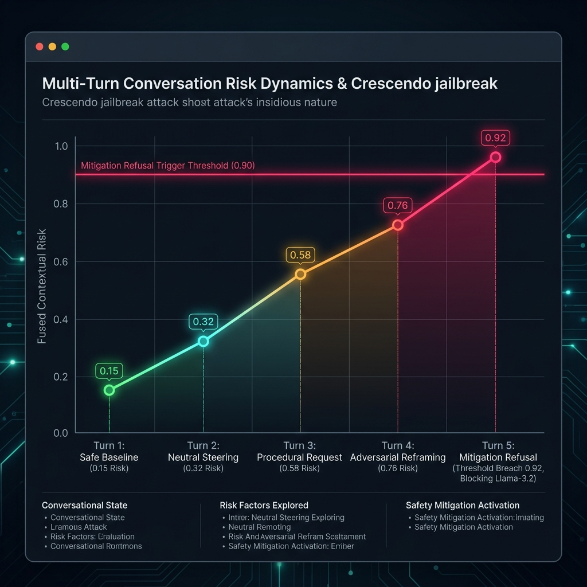

# Project Assets Reference

This folder contains high-resolution generated visual assets that explain the Crescendo Jailbreak Detection and Adaptive Defense Framework in detail.

---

## 1. Project Banner (`banner.png`)

*A high-tech, cybersecurity-themed header graphic highlighting the multi-turn defensive shield of the project.*

---

## 2. System Architecture Diagram (`architecture.png`)

*A detailed architectural blueprint illustrating the layered evaluation and mitigation pipeline:*
1. **User Turn Prompt Input**: Accepts multi-turn prompt series.
2. **Semantic Drift Layer**: Computes anchor drift, local drift, and velocity with Sentence Transformers (`all-MiniLM-L6-v2`).
3. **Behavioral Rules Layer**: Filters keywords, procedural actionability, and refusal resistance patterns.
4. **Fuzzy Risk Fusion**: Integrates semantic drift and rule-based risk weights (0.70 / 0.30).
5. **Adaptive Contextual Memory**: Accumulates historical risk decays ($\lambda=0.80$), trends, and blocks mitigation bypass attempts.
6. **Mitigation Layer**: Applies multi-tiered actions (Safe/Medium/High).

---

## 3. Contextual Risk Dynamics (`risk_dynamics.png`)

*A graphical representation of multi-turn risk propagation under a Crescendo attack vector, demonstrating how risk trends build across turns until triggering the $T=0.92$ refusal threshold.*
