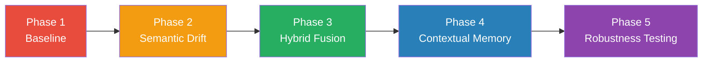
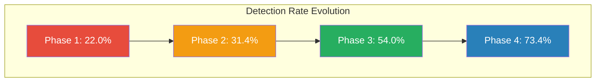
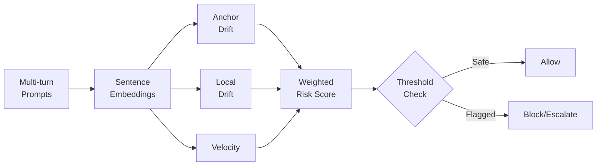
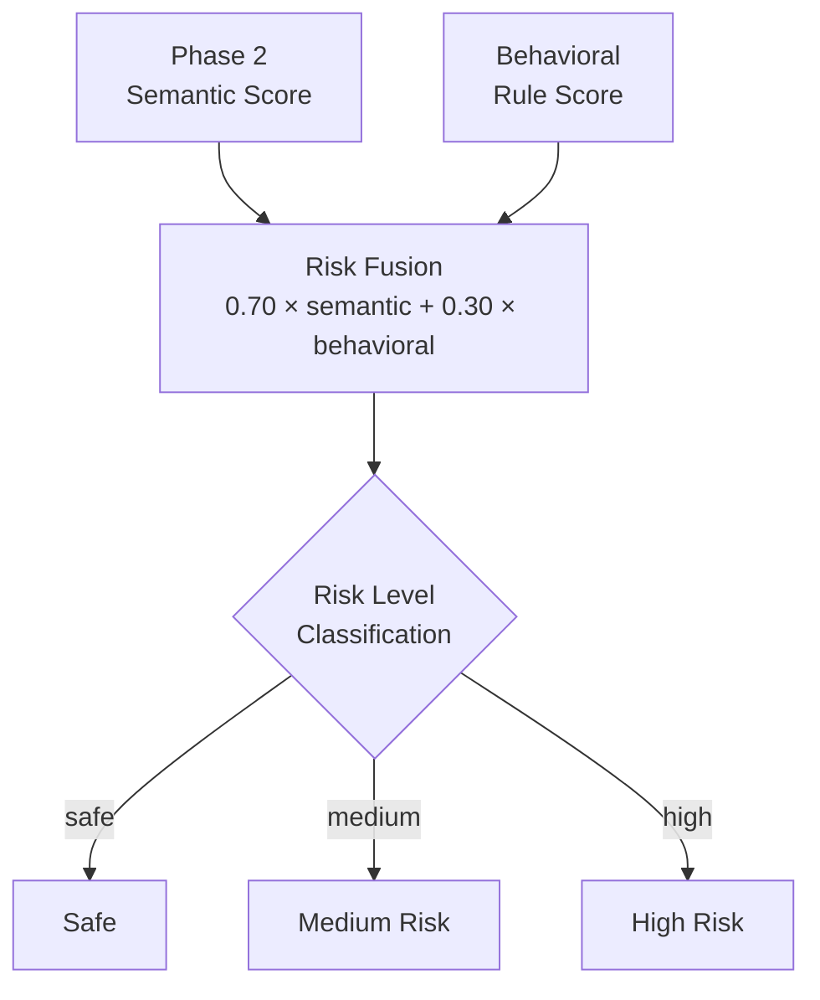
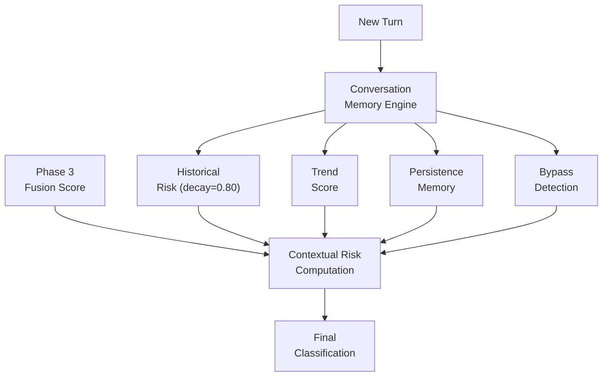

# Architecture Diagram Placeholders

This directory contains architecture diagrams for the Crescendo Jailbreak Defense project.

## Planned Diagrams

| Filename | Description |
|---|---|
| `full_pipeline.png` | End-to-end pipeline: Phase 1 → Phase 5 |
| `phase_evolution.png` | Phase-over-phase metric evolution chart |
| `semantic_drift_pipeline.png` | Phase 2 embedding drift detection flow |
| `hybrid_risk_fusion.png` | Phase 3 behavioral + semantic fusion architecture |
| `contextual_memory_pipeline.png` | Phase 4 conversation memory + contextual risk flow |
| `ablation_summary.png` | Phase 5 component ablation impact chart |

## Generation

Diagrams can be generated from the Mermaid definitions below or from experimental results in `results/`.

### Full Pipeline (Mermaid)

### Phase Evolution (Mermaid)

### Semantic Drift Detection (Mermaid)

### Hybrid Risk Fusion (Mermaid)

### Contextual Memory Pipeline (Mermaid)

