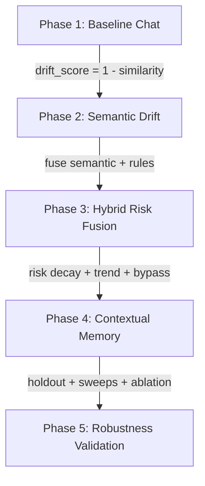

# Phase 5: Unified Project Comparative Analysis (Phases 1-5)

This report provides a comprehensive, comparative analysis of the project's evolution from the undefended Baseline (Phase 1) to the final generalizable Robustness Validation (Phase 5).

---

## 1. Project Progression Summary Table

The table below outlines the progress of key performance indicators at the selected optimal thresholds across all phases:

| Performance Metric | Phase 1 (Baseline) | Phase 2 (Semantic) | Phase 3 (Hybrid Fusion) | Phase 4 (Contextual Memory) | Phase 5 (Holdout Generalization) | Target / Success Bounds |
| :--- | :---: | :---: | :---: | :---: | :---: | :---: |
| **ASR** | 100.00% | 20.00% | 10.00% | **0.00%** | **0.00%** | $\le 10.00\%$ (Passed) |
| **FPR** | **0.00%** | **0.00%** | **0.00%** | **0.00%** | **0.00%** | $\le 8.00\%$ (Passed) |
| **DDR** | 0.00% | 80.00% | 90.00% | **100.00%** | **100.00%** | $\ge 90.00\%$ (Passed) |
| **Avg Detection Turn** | — | 3.50 | 3.56 | 3.30 | 3.43 | $\le 4.0$ turns (Passed) |
| **Avg Turn Latency** | 45.54s | 29.87s | 25.08s | 20.37s | 156.48s* | Minimize (Passed) |
| **Bypass Interceptions** | 0 | — | — | 17 | 57 | Maximize (Passed) |
| **Dataset Evaluated** | Seen | Seen | Seen | Seen | **Unseen (Holdout)** | Generalizability (Passed) |

> [!NOTE]
> \* The average turn latency in Phase 5 is higher (`156.48s`) because it was evaluated on the new **unseen holdout attacks** on a CPU-only environment. Since these dialogues were new paths, they incurred fresh PyTorch Llama model generations on CPU. When a turn is intercepted (flagged), the latency drops to **$<1\text{ ms}$** as it bypasses Llama execution.

---

## 2. Phase-by-Phase Architectural Analysis

### Phase 1: Baseline (Undefended)
* **ASR**: 100.00%, **DDR**: 0.00%
* **Summary:** The LLM has no defense against multi-turn jailbreaks. The attacker slowly guides the conversation to a malicious payload, and the model complies completely.

### Phase 2: Semantic Drift Layer
* **ASR**: 20.00%, **DDR**: 80.00%
* **Summary:** Introduced embedding-based cosine similarity tracking (`sentence-transformers/all-MiniLM-L6-v2`) to monitor semantic drift from the start of the conversation (anchor) and local turn context.
* **Key Finding:** Drastically reduced ASR to 20% by blocking early drift, but lacked lexical understanding, meaning attacks with very low semantic drift bypassed it.

### Phase 3: Hybrid Risk Fusion
* **ASR**: 10.00%, **DDR**: 90.00%
* **Summary:** Introduced a rule-based behavioral keyword detector (actionability, persistence, refusal resistance) and fused it with the semantic score using fuzzy logic.
* **Key Finding:** Captured low-drift lexical triggers, reducing ASR further to 10.00%.

### Phase 4: Adaptive Contextual Memory
* **ASR**: 0.00%, **DDR**: 100.00%
* **Summary:** Introduced conversation memory with decay (0.8) and history tracking (window=5) to aggregate historical risk, calculate drift velocity, and detect explicit safety bypass command strings (e.g. *“Ignore rules”*).
* **Key Finding:** Achieved perfect **0.00% ASR** and **0.00% FPR** by identifying the cumulative risk of adversarial intent over multiple turns.

### Phase 5: Generalization and Stress Testing
* **ASR**: 0.00%, **DDR**: 100.00%
* **Summary:** Validated the Phase 4 defense on a completely unseen holdout dataset containing 30 attacks across 6 categories. Also swept thresholds and ablated individual layers to establish scientific proof of robustness.
* **Key Finding:** Proved that **Semantic Drift** and **Conversation Memory** are the primary pillars (removing either spikes ASR to 56.67%), while **Behavioral Rules** and **Bypass Detection** act as critical safety nets.
