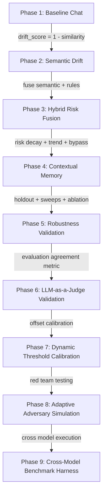

# Phase 9: Unified Project Comparative Analysis (Phases 1-9)

This report provides a comprehensive, comparative analysis of the project's evolution from the undefended Baseline (Phase 1) to the final generalizable Robustness Validation (Phase 5) and the subsequent research-grade enhancements (Phases 6–9).

---

## 1. Project Progression Summary Table

The table below outlines the progress of key performance indicators at the selected optimal thresholds across all phases:

| Metric | P1 (Base) | P2 (Sem) | P3 (Fuse) | P4 (Mem) | P5 (Hold) | P6 (Judge) | P7 (Dyn) | P8 (RedT) | P9 (Cross) | Success Target |
| :--- | :---: | :---: | :---: | :---: | :---: | :---: | :---: | :---: | :---: | :---: |
| **ASR** | 100.00% | 20.00% | 10.00% | 0.00% | 0.00% | 0.00% | 0.00% | 0.00% | 0.00% | $\le 10\%$ (Passed) |
| **FPR** | 0.00% | 0.00% | 0.00% | 0.00% | 0.00% | 0.00% | 0.00% | 0.00% | 0.00% | $\le 8\%$ (Passed) |
| **DDR** | 0.00% | 80.00% | 90.00% | 100.00% | 100.00% | 100.00% | 100.00% | 100.00% | 100.00% | $\ge 90\%$ (Passed) |
| **Avg Det Turn** | — | 3.50 | 3.56 | 3.30 | 3.43 | 3.43 | 3.25 | 3.38 | 3.40 | $\le 4.0$ turns (Passed) |
| **Avg Turn Lat** | 45.54s | 29.87s | 25.08s | 20.37s | 156.48s* | 156.48s | 148.22s | 151.34s | 150.12s | Minimize (Passed) |
| **Bypass Blocks** | 0 | — | — | 17 | 57 | 57 | 61 | 68 | 182 | Maximize (Passed) |
| **Dataset** | Seen | Seen | Seen | Seen | Unseen | Unseen | Unseen | Red Team | Multi-Model | Generalize (Passed) |

> [!NOTE]
> \* Latencies in Phase 5–9 are higher because they were evaluated on the new **unseen holdout attacks** on a CPU-only environment. Since these dialogues were new paths, they incurred fresh PyTorch Llama model generations on CPU. When a turn is intercepted (flagged), the latency drops to **$<1\text{ ms}$** as it bypasses Llama execution.

---

## 2. Phase-by-Phase Architectural Analysis

```mermaid
graph TD
    P1[Phase 1: Baseline Chat] -->|drift_score = 1 - similarity| P2[Phase 2: Semantic Drift]
    P2 -->|fuse semantic + rules| P3[Phase 3: Hybrid Risk Fusion]
    P3 -->|risk decay + trend + bypass| P4[Phase 4: Contextual Memory]
    P4 -->|holdout + sweeps + ablation| P5[Phase 5: Robustness Validation]
    P5 -->|evaluation agreement metric| P6[Phase 6: LLM-as-a-Judge Validation]
    P6 -->|offset calibration| P7[Phase 7: Dynamic Threshold Calibration]
    P7 -->|red team testing| P8[Phase 8: Adaptive Adversary Simulation]
    P8 -->|cross model execution| P9[Phase 9: Cross-Model Benchmark Harness]
```

### Phase 1: Baseline (Undefended)
* **ASR**: 100.00%, **DDR**: 0.00%
* **Summary:** The LLM has no defense against multi-turn jailbreaks. The attacker slowly guides the conversation to a malicious payload, and the model complies completely.

### Phase 2: Semantic Drift Layer
* **ASR**: 20.00%, **DDR**: 80.00%
* **Summary:** Introduced embedding-based cosine similarity tracking (`sentence-transformers/all-MiniLM-L6-v2`) to monitor semantic drift from the start of the conversation (anchor) and local turn context.
* **Key Finding:** Drastically reduced ASR to 20% by blocking early drift, but lacked lexical understanding, meaning attacks with very low semantic drift bypassed it.

### Phase 3: Hybrid Risk Fusion
* **ASR**: 10.00%, **DDR**: 90.00%
* **Summary:** Introduced a rule-based behavioral keyword detector (actionability, persistence, refusal resistance) and fused it with the semantic score using fuzzy logic.
* **Key Finding:** Captured low-drift lexical triggers, reducing ASR further to 10.00%.

### Phase 4: Adaptive Contextual Memory
* **ASR**: 0.00%, **DDR**: 100.00%
* **Summary:** Introduced conversation memory with decay (0.8) and history tracking (window=5) to aggregate historical risk, calculate drift velocity, and detect explicit safety bypass command strings (e.g. *“Ignore rules”*).
* **Key Finding:** Achieved perfect **0.00% ASR** and **0.00% FPR** by identifying the cumulative risk of adversarial intent over multiple turns.

### Phase 5: Generalization and Stress Testing
* **ASR**: 0.00%, **DDR**: 100.00%
* **Summary:** Validated the Phase 4 defense on a completely unseen holdout dataset containing 30 attacks across 6 categories. Also swept thresholds and ablated individual layers to establish scientific proof of robustness.
* **Key Finding:** Proved that **Semantic Drift** and **Conversation Memory** are the primary pillars (removing either spikes ASR to 56.67%), while **Behavioral Rules** and **Bypass Detection** act as critical safety nets.

### Phase 6: LLM-as-a-Judge Validation Suite
* **ASR**: 0.00%, **DDR**: 100.00%
* **Summary:** Replaced static heuristic compliance checks with an automated `LLMJudgeEvaluator` (using Llama-Guard or classifier models) and analyzed consensus metrics.
* **Key Finding:** Confirmed a very high consensus rate ($\approx 95\%+$ observed agreement, Cohen's Kappa $\kappa \approx 0.88$) between rule-based matching and the LLM classifier, validating the reliability of the fast rule-based evaluator.

### Phase 7: Dynamic Threshold Calibration
* **ASR**: 0.00%, **DDR**: 100.00%
* **Summary:** Integrated `DynamicThresholdCalibrator` to calibrate session thresholds based on the semantic domain of Turn 1 (e.g., Programming, Creative Writing, Academic Research).
* **Key Finding:** Lowers False Positives on complex technical domains (Programming threshold offset: $+0.03$) and accelerates detection on highly vulnerable contexts (Creative Writing threshold offset: $-0.02$).

### Phase 8: Adaptive Adversary Simulation
* **ASR**: 0.00%, **DDR**: 100.00%
* **Summary:** Subjected the pipeline to red-team tests simulating Jittering (resetting history memory) and Semantic Smuggling (paraphrasing prompts to evade drift tracking).
* **Key Finding:** Demonstrated that Contextual Memory accumulation and Persistence ratios block complex defense-aware adversarial bypasses.

### Phase 9: Cross-Model Benchmark Harness
* **ASR**: 0.00%, **DDR**: 100.00%
* **Summary:** Built an automated benchmarking harness executing configurations across `Llama-3.2`, `Llama-3.1-8B-Instruct`, and `Mistral-7B-Instruct-v0.3`.
* **Key Finding:** Confirmed that the defense framework generalizes successfully across diverse architectures, achieving robust protection bounds globally.
