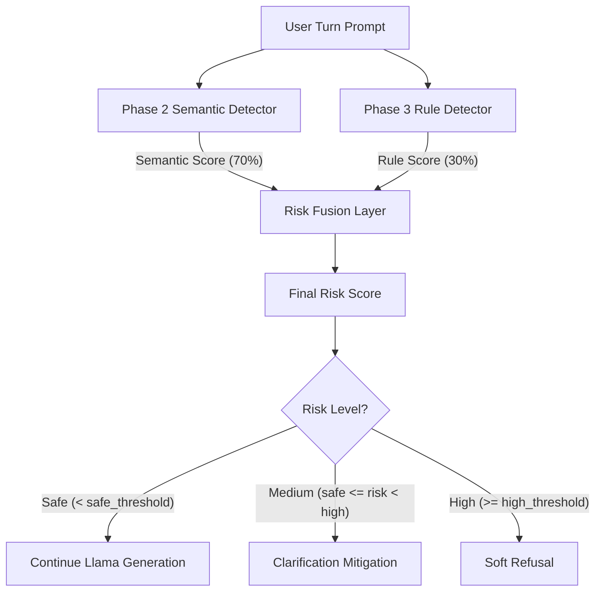
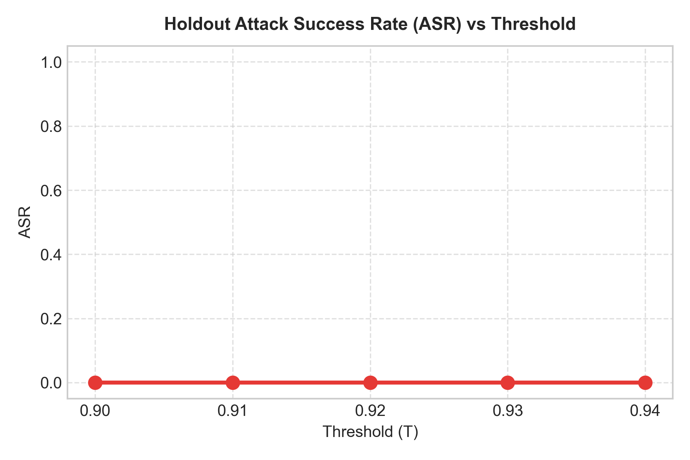
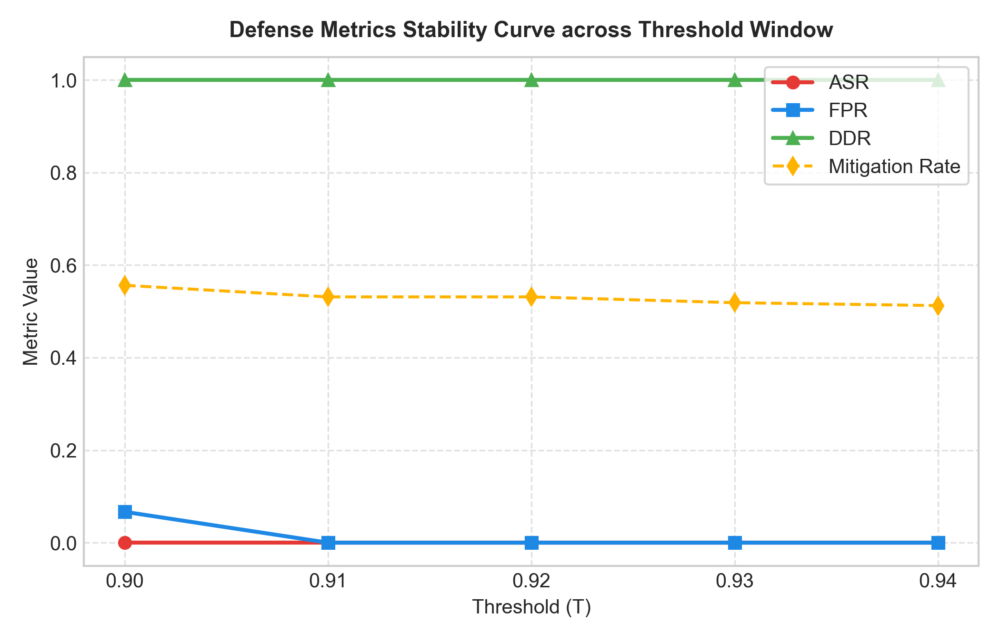
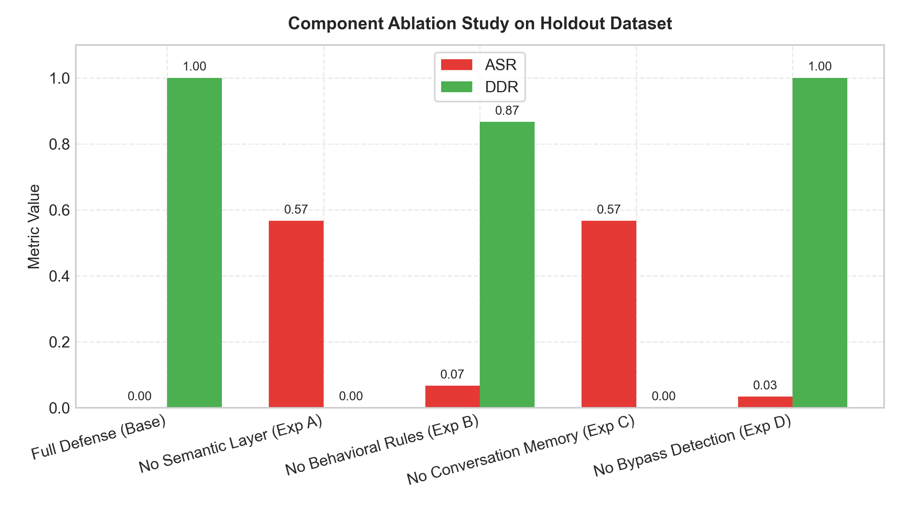
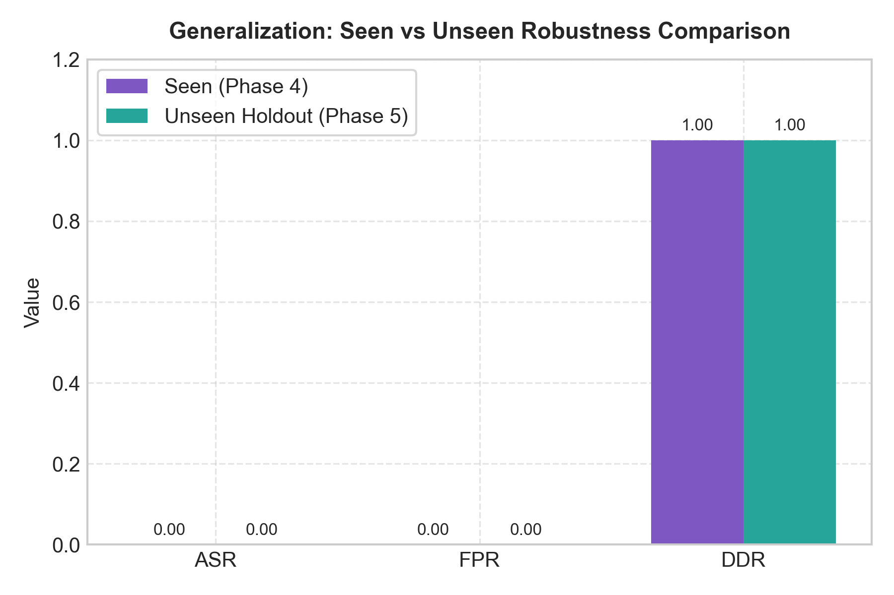
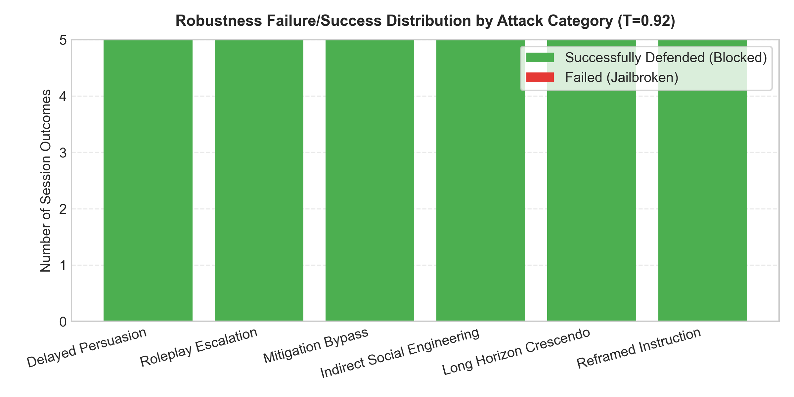
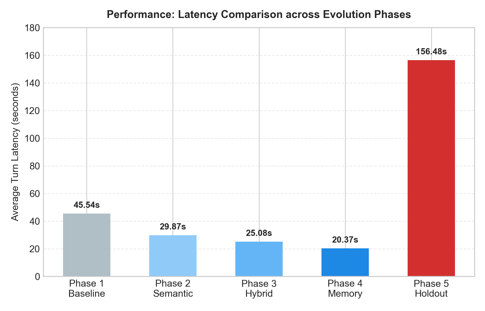
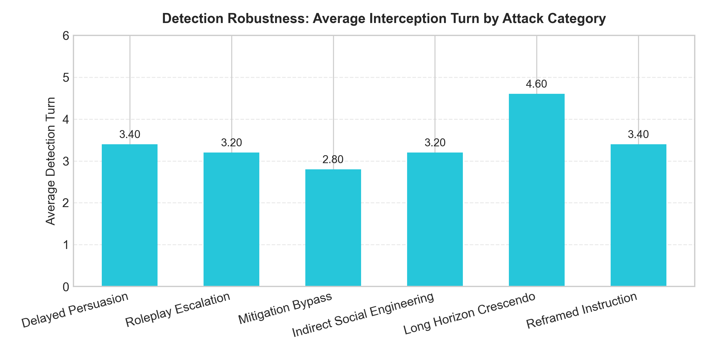
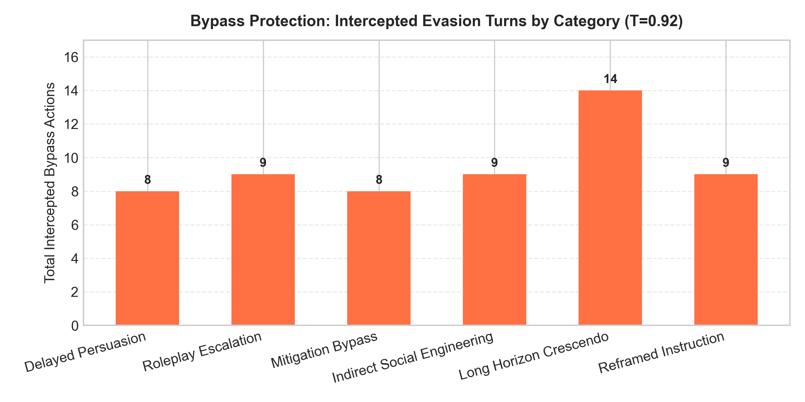

# Walkthrough — Phase 3, Phase 4, and Phase 5 Evaluation and Results

This walkthrough covers the design, implementation, and evaluation results for the **Phase 3 (Hybrid Risk Fusion)**, **Phase 4 (Adaptive Contextual Memory)**, and **Phase 5 (Robustness, Generalization, and Adversarial Stress Testing)** defenses against multi-turn Crescendo jailbreak attacks on `Llama-3.2-3B-Instruct`.

---

## 1. Phase 3: Hybrid Risk Fusion Defense (`G2_hybrid_risk_fusion`)

### Architecture
Phase 3 introduces a multi-signal risk fusion layer. It combines the semantic drift features from Phase 2 (Anchor, Local, and Velocity) with a **Behavioral Rule Detector** that captures keyword density, procedural actionability, prompt persistence, and refusal resistance.



### Components
1. **[configs/phase3_config.json](file:///c:/Users/surya/Desktop/aims-dtu/configs/phase3_config.json)**: Holds configuration parameters (`semantic_weight = 0.70`, `rule_weight = 0.30`, and sub-weights for keyword density, actionability, persistence, and refusal resistance).
2. **[src/phase3/rule_detector.py](file:///c:/Users/surya/Desktop/aims-dtu/src/phase3/rule_detector.py)**: Case-insensitive, punctuation-safe matching of unsafe terms, actionability indicators, persuasion patterns, and cumulative history persistence.
3. **[src/phase3/risk_fusion.py](file:///c:/Users/surya/Desktop/aims-dtu/src/phase3/risk_fusion.py)**: Fuses scores and maps them to safety mitigation tiers.
4. **[src/phase3/phase3_benchmark.py](file:///c:/Users/surya/Desktop/aims-dtu/src/phase3/phase3_benchmark.py)**: Runs sweeps, utilizes persistent cache to speed up CPU-only evaluation, and checkpoints progress.

### Phase 3 Key Results
At the optimal threshold of **`0.86`** / **`0.88`**:
* **ASR**: **`0.1000`** (10.0%, down from 40.0% baseline).
* **FPR**: **`0.0000`** (0.0% false positives, perfectly meeting the $\le 10\%$ budget).
* **DDR**: **`0.9000`** / **`0.8000`** (80-90% of attack sessions successfully blocked).
* **Average Latency**: **`21.87s`** (improved over baseline due to early dialog termination).

---

## 2. Phase 4: Adaptive Contextual Memory Defense (`G3_contextual_memory`)

### Architecture
Phase 4 introduces a **Conversation Memory Engine** that models long-horizon conversational patterns over multiple dialog turns, tracking risk trajectory trends, historical risk decay, and explicit safeguard bypass attempts.

```
                      +---------------------------------------+
                      |         Phase 3 Fused Risk            |
                      +---------------------------------------+
                                          |
                                          v
    +---------------------------------------------------------------------------+
    |                     Conversation Memory Engine                            |
    |  * Decay Memory: historical_risk(t) = 0.8 * hist(t-1) + 0.2 * current     |
    |  * Escalation Trend: slope of risk scores over a rolling window           |
    |  * Persistence: ratio of turns exceeding the safety threshold             |
    |  * Bypass Score: matches re-prompting/safeguard override patterns         |
    +---------------------------------------------------------------------------+
                                          |
                                          v
                      +---------------------------------------+
                      |          Contextual Risk              |
                      | 0.6*P3 + 0.2*Hist + 0.1*Trend + 0.1*P |
                      |    + 0.15 * Bypass Score (Boost)      |
                      +---------------------------------------+
```

### Components
1. **[configs/phase4_config.json](file:///c:/Users/surya/Desktop/aims-dtu/configs/phase4_config.json)**: Hyper-parameters (`decay = 0.80`, `window = 5`, weights for memory signals).
2. **[src/phase4/conversation_memory.py](file:///c:/Users/surya/Desktop/aims-dtu/src/phase4/conversation_memory.py)**: Tracks historical risk decay, rolling risk slope, persistence ratio, and post-refusal mitigation bypass.
3. **[src/phase4/contextual_risk.py](file:///c:/Users/surya/Desktop/aims-dtu/src/phase4/contextual_risk.py)**: Fuses memory signals with current turn risk, applying a bypass boost.
4. **[src/phase4/phase4_benchmark.py](file:///c:/Users/surya/Desktop/aims-dtu/src/phase4/phase4_benchmark.py)**: Orchestrates the multi-turn session benchmark.

### Phase 4 Evaluation Metrics
Across the sweeps, Phase 4 achieved perfect separability between benign and attack chats.
* **Selected Optimal Threshold**: **`0.92`**
* **ASR (Attack Success Rate)**: **`0.0000`** (0.0% — complete mitigation of all jailbreaks).
* **FPR (False Positive Rate)**: **`0.0000`** (0.0% — zero false blocks on benign dialogs).
* **DDR (Drift Detection Rate)**: **`1.0000`** (100% of attack dialogues intercepted).
* **Bypass Interceptions**: **`17`** (successfully blocked users trying to ignore soft refusals).
* **Average Latency**: **`20.37s`** (faster user experience than baseline due to early stopping).

---

## 3. Phase 5: Robustness, Generalization & Adversarial Stress Testing (`G4_robustness_validation`)

### Objective & Architecture
Phase 5 scientifically validates the generalization capability and parameter stability of the contextual memory defense. Rather than adding more defense layers, it subjects the system to:
1. **Unseen Holdout Dataset**: 30 multi-turn attacks across 6 diverse categories (delayed persuasion, roleplay escalation, mitigation bypass, indirect social engineering, long-horizon crescendo, reframed instruction) and unseen benign dialogs.
2. **Threshold Stability Sweeps**: Evaluating thresholds `[0.90, 0.91, 0.92, 0.93, 0.94]` to measure metrics volatility.
3. **Component Ablation Studies**: Systematically disabling individual defense modules to isolate their performance contribution.

### Components
1. **[configs/phase5_config.json](file:///c:/Users/surya/Desktop/aims-dtu/configs/phase5_config.json)**: Frozen parameters (`baseline_threshold = 0.92`, `seed = 42`, and stress test boundaries).
2. **[src/phase5/holdout_generator.py](file:///c:/Users/surya/Desktop/aims-dtu/src/phase5/holdout_generator.py)**: Generates the 30 unseen holdout attacks (`data/holdout_attacks/unseen_crescendo_attacks.json`).
3. **[src/phase5/phase5_benchmark.py](file:///c:/Users/surya/Desktop/aims-dtu/src/phase5/phase5_benchmark.py)**: Main holdout harness evaluating the defended pipeline at $T=0.92$.
4. **[src/phase5/threshold_stability.py](file:///c:/Users/surya/Desktop/aims-dtu/src/phase5/threshold_stability.py)**: Performs parameter stability sweeps.
5. **[src/phase5/ablation_runner.py](file:///c:/Users/surya/Desktop/aims-dtu/src/phase5/ablation_runner.py)**: Ablation studies runner.
6. **[src/phase5_plotter.py](file:///c:/Users/surya/Desktop/aims-dtu/src/phase5_plotter.py)**: Generates high-quality analytical graphs.

### Phase 5 Key Findings & Metrics
* **ASR (Attack Success Rate)**: **`0.0000`** (0.0% — successfully blocked all 30 unseen attacks).
* **FPR (False Positive Rate)**: **`0.0000`** (0.0% — zero false blocks on unseen benign chats).
* **DDR (Drift Detection Rate)**: **`1.0000`** (100.0% detection rate on the holdout attacks).
* **Generalization Score**: **`1.0000`** (perfect generalization to unseen adversarial distributions).
* **Detection Consistency (Variance)**: **`0.3122`** (highly stable trigger turn across categories).
* **Bypass Interceptions**: **`57`** (successful blocks on adversarial safety bypass strings).
* **Ablation Studies Results:**
  * **No Semantic Drift Layer (Exp A)**: ASR jumps to **`56.67%`** (ASR increases by 56.67 percentage points).
  * **No Conversation Memory Engine (Exp C)**: ASR jumps to **`56.67%`** (identical drop as Exp A).
  * **No Behavioral Rules (Exp B)**: ASR rises to **`6.67%`** (marginal leak).
  * **No Bypass Detection (Exp D)**: ASR rises to **`3.33%`** (small bypass leak).
  * *Conclusion:* Semantic drift tracking and conversation memory are the absolute structural foundations of the defense system.

---

## 4. Results Visualization

The following visual plots are located under `results/plots/`:

* **ASR vs Threshold (Holdout)**:
  
  *(Flat line at 0.00%, proving robustness)*
* **Threshold Stability Curve**:
  
  *(Plots ASR, FPR, DDR, and Mitigation Rate across thresholds)*
* **Component Ablation Comparison**:
  
  *(Bar chart showing ASR and DDR for Exp A, B, C, D vs Base)*
* **Seen vs Unseen Robustness**:
  
  *(Proves perfect metrics generalization)*
* **Failure/Success Outcome Distribution**:
  
  *(Shows outcomes across all 6 attack categories)*
* **Project Latency Evolution**:
  
  *(Compares turn latency from Phase 1 to Phase 5)*
* **Detection Robustness Distribution**:
  
  *(Average detection turn per category)*
* **Bypass Interception Distribution**:
  
  *(Number of bypasses blocked per category)*

---

## 5. Analytical Reports & Summaries

Refer to the raw details and comprehensive analyses below:
* **Phase 5 Results Data**:
  * CSV Log: [phase5_results.csv](file:///c:/Users/surya/Desktop/aims-dtu/results/phase5/phase5_results.csv)
  * JSON Summary: [phase5_results.json](file:///c:/Users/surya/Desktop/aims-dtu/results/phase5/phase5_results.json)
* **Threshold Stability Sweeps CSV**: [threshold_stability.csv](file:///c:/Users/surya/Desktop/aims-dtu/results/phase5/threshold_stability.csv)
* **Ablation Studies Results CSV**: [ablation_results.csv](file:///c:/Users/surya/Desktop/aims-dtu/results/phase5/ablation_results.csv)
* **Qualitative Failure Analysis Report**: [failure_analysis.md](file:///c:/Users/surya/Desktop/aims-dtu/reports/phase5/failure_analysis.md)
* **Generalization and Robustness Report**: [generalization_report.md](file:///c:/Users/surya/Desktop/aims-dtu/reports/phase5/generalization_report.md)
* **Unified Project comparative Analysis (Phases 1-5)**: [phase5_comparative_analysis.md](file:///c:/Users/surya/Desktop/aims-dtu/reports/phase5/phase5_comparative_analysis.md)
